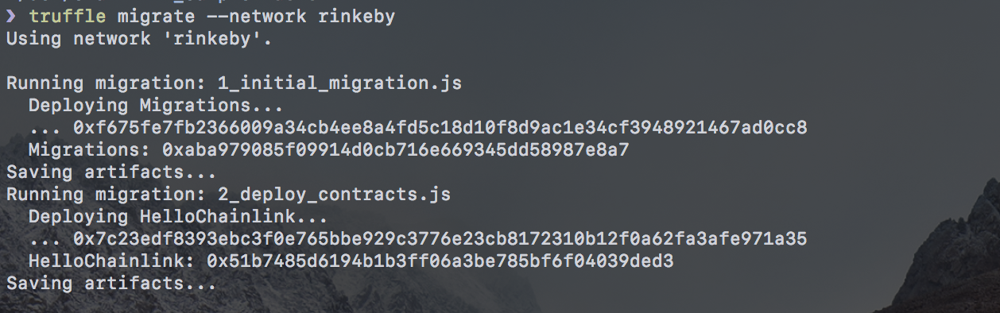
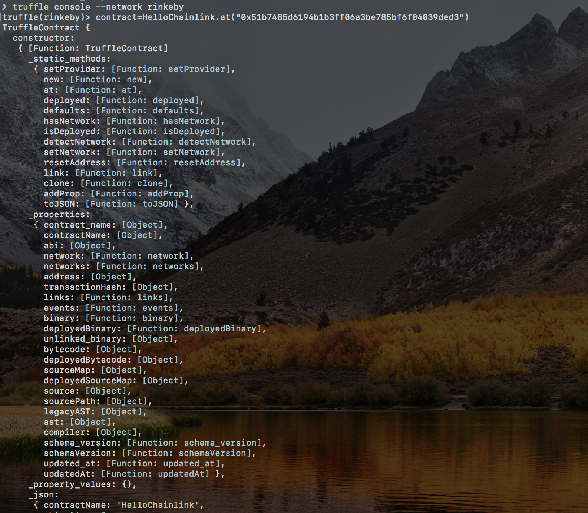

# Chainlink Sample

## First Chainlink Contract

1. Deploy contract

2. Exec truffle console and set contract

3. Run requestEthereumPrice

4. Check ethereum current price

## Reference
- [rinkeby.etherscan](https://rinkeby.etherscan.io/)

- [infura.io](https://infura.io/)

- [Rinkeby faucet](https://rinkeby.chain.link/)

- [Chainlinks (Testnet)](https://docs.chain.link/docs/available-oracles)

- [USING TRUFFLE TO INTERACT WITH CHAINLINK SMART CONTRACTS](https://www.trufflesuite.com/blog/using-truffle-to-interact-with-chainlink-smart-contracts)

- HelloChainlink Contract

  - https://rinkeby.etherscan.io/address/0x51b7485d6194b1b3ff06a3be785bf6f04039ded3

